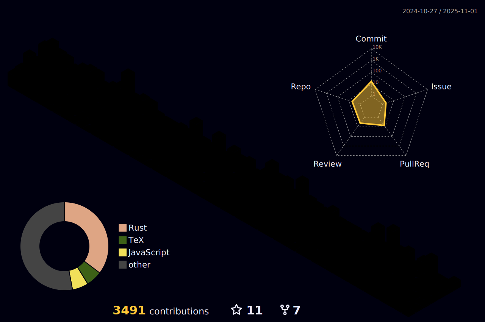

|  |  |  
| ----------- | ----------- |

### Hi there, I'm Pedro Henrique - a Software Engineer with a rich background in software development and teaching.

As a software engineer, my journey has been marked by a strong focus on developing, contributing to software factories, and working closely with clients. My primary stack revolves around Node.js, yet my versatility extends to collaborating within multidisciplinary teams, leveraging a wide array of languages and technologies to deliver high-quality software solutions.

One of my most notable achievements includes designing algorithms capable of processing massive datasets from Excel spreadsheets and efficiently recording them. This particular project underscored my ability to handle large-scale data, reflecting my knack for creating impactful, data-driven applications.

My technical arsenal is well-equipped with tools and technologies such as Docker, Git, NestJS, MySQL, MongoDB, and a suite of AWS services including S3, SNS, SQS, SES, EC2, and Lambda. These skills have been instrumental in constructing dashboards, developing Lambda-based algorithms, and enhancing error handling mechanisms.

 

##

  

 
 

